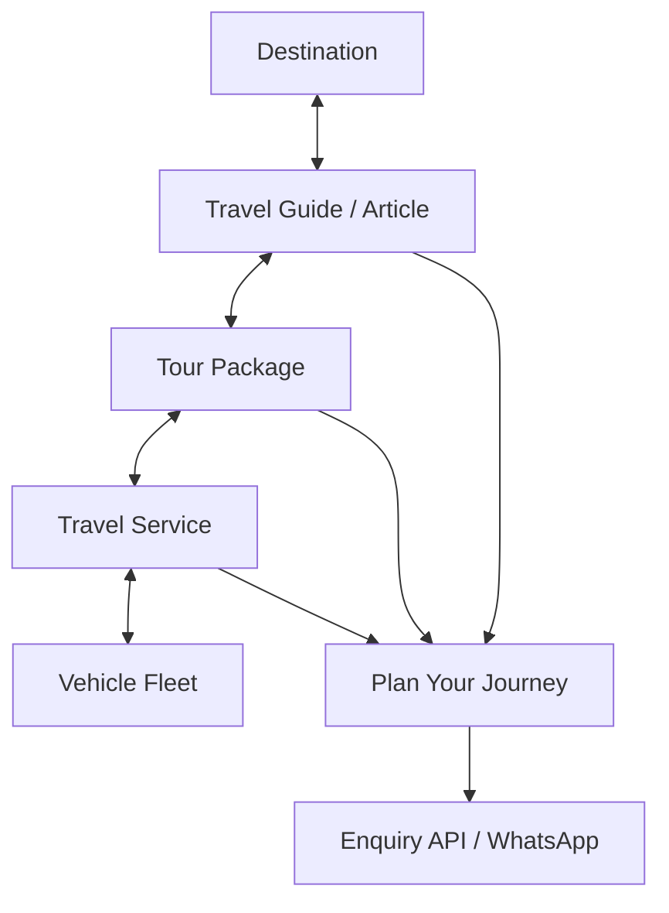

# MAHALAKSHMI TOUR & TRAVEL — TECHNICAL ARCHITECTURE DOCUMENTATION

**Project**: Mahalakshmi Tour & Travel (Madurai, Tamil Nadu, India)  
**Lead Architecture**: Next.js 15+ App Router, React 19, TypeScript (Strict), Tailwind CSS v4  
**Design System**: *Ink* (`#171716`) + *Terracotta* (`#A65F43`) + *Warm Paper* (`#F2EEE5`)  
**Brand Metaphor**: *The Incomplete Journey* ("We help you complete your journey")

---

## 1. System Architecture & Tech Stack

```
mahalakshmi-travels/
├── src/
│   ├── app/                           # Next.js 15 App Router Routes (SSG + API)
│   │   ├── (canonical static routes)  # /, /about, /contact, /destinations, /tours, /travel-services...
│   │   ├── destinations/[slug]/       # Dynamic SSG Destination Pages
│   │   ├── tours/[slug]/              # Dynamic SSG Tour Detail Pages
│   │   ├── travel-services/[slug]/    # Dynamic SSG Travel Service Pages
│   │   ├── vehicles/[slug]/           # Dynamic SSG Vehicle Pages
│   │   ├── travel-guide/[slug]/       # Dynamic SSG Travel Article Pages
│   │   ├── plan-your-journey/         # Progressive Custom Journey Planner Hub
│   │   ├── api/enquiry/               # Server-Side Enquiry Endpoint (POST)
│   │   ├── sitemap.ts                 # Dynamic XML Sitemap Generator
│   │   └── robots.ts                  # Dynamic robots.txt
│   ├── components/                    # Component Architecture
│   │   ├── brand/                     # SVG Logo System & Symbols
│   │   ├── ui/                        # Design System Primitives (Button, Card, Badge, DataAnchor...)
│   │   ├── home/                      # Homepage Narrative Sections (10 Steps)
│   │   ├── map/                       # South India SVG Interactive Map Engine
│   │   ├── tours/                     # Tour Listing & Detail Components
│   │   ├── services/                  # "Who's Coming?" Discovery Assistant & Fleet Blocks
│   │   ├── enquiry/                   # 6-Step Progressive Journey Planner Components
│   │   ├── guide/                     # Travel Guide Publication Hub & Article Components
│   │   ├── layout/                    # Header, Footer, Mobile Navigation
│   │   └── seo/                       # JsonLd & Breadcrumb Navigation
│   ├── config/                        # Central Business & Site Configuration
│   │   ├── business.ts                # Real Fleet Specs, Phone, WhatsApp, Madurai HQ
│   │   └── site.ts                    # Site URL, Metadata, Navigation Links
│   ├── lib/                           # Data Access Layer & Business Logic
│   │   ├── data/                      # Repositories & Relational DAL
│   │   ├── conversion/                # WhatsApp, Phone, Validation, Reference Code
│   │   └── seo/                       # Schema.org JSON-LD Generators & Metadata Helpers
│   ├── styles/                        # Design Tokens & Typography
│   │   ├── tokens.css                 # Color, Radius, Shadow Tokens
│   │   ├── typography.css             # Display, Serif, Body, Mono Hierarchy
│   │   ├── motion.css                 # Easing & Motion Rules
│   │   └── globals.css                # Tailwind CSS v4 Theme Bindings
│   └── types/                         # TypeScript Domain Models
```

---

## 2. The Content Graph & Relational DAL

Every domain entity participates in an interconnected content graph resolved via `src/lib/data/relationships.ts`:



### Relational Resolvers in `src/lib/data/relationships.ts`:
- `resolveTourRelations(slug)`: Resolves `tour`, `destination`, `relatedTours`, `relatedArticles`, and `availableVehicles`.
- `resolveDestinationRelations(slug)`: Resolves `destination`, `tours`, and `articles`.
- `resolveVehicleRelations(slug)`: Resolves `vehicle`, compatible `services`, and `popularTours`.
- `resolveServiceRelations(slug)`: Resolves `service`, compatible `vehicles`, and matching `tours`.
- `resolveArticleRelations(slug)`: Resolves `article`, `connectedTour`, `connectedService`, `destination`, and `relatedArticles`.

---

## 3. Real Fleet & Operations Matrix

| Vehicle Category | Capacity | Key Specifications | Primary Use Cases |
| :--- | :--- | :--- | :--- |
| **21-Seater Flagship Van** | `20+1` Passengers | High-roof, dual AC, pushback seats, deep luggage bay, PA system | College IVs, wedding groups, joint family pilgrimages |
| **Sedan-Type Cars** | `4+1` Passengers | Dual AC, cushioned suspension, generous boot space | Hill station couple tours, small family outstation trips, airport transfers |

---

## 4. Conversion & Enquiry Pipeline

The conversion architecture strictly adheres to **Discovery $\rightarrow$ Planning $\rightarrow$ Enquiry** (No live payment gateways or fake inventory):

1. **Deterministic Reference Code**: Every enquiry is stamped with `ML-26-XXXX` generated by `src/lib/conversion/reference.ts`.
2. **Server-Side Validation & Anti-Spam**:
   - `src/lib/conversion/validation.ts` sanitizes all strings and validates required passenger counts, routes, phone/WhatsApp format.
   - Hidden honeypot field (`website_url`) traps automated spam bots silently.
3. **Structured WhatsApp Link Generator**: `buildWhatsAppUrl(payload)` in `src/lib/conversion/whatsapp.ts` encodes structured intent, passengers, route halts, and vehicle selection for one-tap WhatsApp messaging to the Madurai travel desk.

---

## 5. Technical SEO & Schema.org Graph

| Schema Type | Implementation Location | Target Pages |
| :--- | :--- | :--- |
| `LocalBusiness` / `TravelAgency` | `src/lib/seo/schema.ts` | Root Layout (`layout.tsx`) on every page |
| `TouristTrip` | `src/lib/seo/schema.ts` | Tour Detail Pages (`/tours/[slug]`) |
| `Service` | `src/lib/seo/schema.ts` | Travel Service Pages (`/travel-services/[slug]`) |
| `Article` / `BlogPosting` | `src/lib/seo/schema.ts` | Travel Guide Pages (`/travel-guide/[slug]`) |
| `BreadcrumbList` | `src/lib/seo/schema.ts` | All subpages across directory hierarchies |
| `FAQPage` | `src/lib/seo/schema.ts` | Home and Service pages |

---

## 6. How to Add New Content

### A. Adding a New Tour
1. Open `src/lib/data/tours.ts`.
2. Add an entry to `toursRepository` conforming to `Tour` interface in `src/types/tour.ts`.
3. Specify `slug`, `title`, `duration`, `routePoints`, `itineraryDays`, `highlights`, `inclusions`, `exclusions`, `travelOptions`, and `seo`.
4. Next.js will automatically statically pre-render the new route `/tours/[slug]` and include it in `/sitemap.xml`.

### B. Adding a New Travel Guide Article
1. Open `src/lib/data/articles.ts`.
2. Add an entry to `travelArticlesRepository` conforming to `TravelArticle` in `src/types/article.ts`.
3. Provide `title`, `slug`, `excerpt`, `content` (Markdown formatted with H2 `{#id}` anchors), `category`, `articleType`, `keyFacts`, `tableOfContents`, `connectedTourSlug`, and `connectedServiceSlug`.
4. The article will automatically be indexed on `/travel-guide`, pre-rendered at `/travel-guide/[slug]`, and linked into the content graph.

### C. Adding a New Destination
1. Open `src/lib/data/destinations.ts`.
2. Add an entry conforming to `Destination` in `src/types/destination.ts`.
3. Update SVG coordinates in `src/lib/data/mapData.ts` if the destination should be represented on the interactive South India map.

---

## 7. Production Deployment & Verification Checklist

- [x] **TypeScript Strict Check**: `npm run typecheck` (`tsc --noEmit`) passes with 0 errors.
- [x] **Next.js Production Build**: `npm run build` generates all 42+ static & dynamic routes in $<3.5\text{s}$.
- [x] **Security Headers**: HSTS, X-Content-Type-Options, X-Frame-Options, Referrer-Policy configured in `next.config.ts`.
- [x] **Accessibility**: Skip link implemented, keyboard focus rings verified, touch targets $>44\text{px}$.
- [x] **Sitemap & Robots**: Dynamic `sitemap.xml` and `robots.txt` automatically reflect active domain from `siteConfig.url`.
